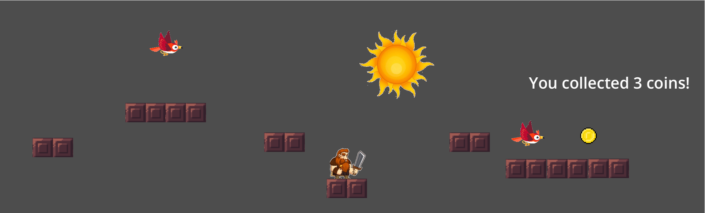

This is the Assignment 3 for Xueqi Cheng

## Introduction

The assignment is to create a 2D platformer game using Godot. The game is to control the warrior to reach the final point through platforms while getting as many coins as possible. There are enemies (birds) in the game, and the player should avoid touching them. Some platforms are moving. The game is over when the player touches the enemy or falls off the platform. The project is written on MacOS with M4 chip.

## Screenshot

Here is a screenshot of the project:



## How to play

The player can use the arrow keys to move the warrior. The player can jump by pressing the space key. 

## How to run the project

1. Download the project from the repository, or clone it using git:
``` git clone https://github.com/Vanderbilt-GameDev-2025/Assignment3-Xueqi-Cheng.git ```
2. Open the project in Godot.
3. Delete the existing `godot-cpp` folder in the project.
4. ``` git clone -b 4.3 https://github.com/godotengine/godot-cpp ```
5. scons platform=<platform> where <platform> is your platform of choice.
3. Click the play button on the top-right corner to run the project.


## Key Features

1. Player locomotion: The player can move the warrior using the arrow keys and jump using the space key.
2. Collision detection: The player will die if it touches the enemy or falls off the platform.
3. Scoring: The player can collect coins to increase the score, the final score is shown on the screen.
4. GDExtension: The project uses GDExtension to "SpinPhysicis" to rotate the Node2D, and it is used to create a spinning sun.
5. [Extra Credit] There is background music in the game. The music is played when the game starts and stops when the player dies.
6. [Extra Credit] NPCs: There are enemies (birds) in the game, and the player should avoid touching them.

## Video

The video is available [here](https://www.youtube.com/watch?v=Ql2DDNrDGHw).